# Native session/sidebar scope proof

Source: `3ab1261e62b3764777a2d2eddfb3623474513640`.

- iOS build-for-testing: passed.
- 104 app tests in five suites: passed (sidebar order, tabs presentation, sidebar actions, session menu, branded typography).
- One native UI workflow: passed. Opened sidebar/header menus, status filter, Pages editor, appearance and assignment sheets; saved a rename and observed the updated row; copied Session ID and observed confirmation.
- Seven shared session-authority tests: passed. Current connection, row incarnation, ownership, field permissions, and retired-menu boundaries remain enforced.
- Changed Swift formatting and production-source lint: passed.
- Exact 52,891 source-file manifest verified before and after native validation. Patch SHA-256: `b4ba49dff5830e6b00df0aaef7732bf7a579c777e3f9e4b10bc5577974c17c9b`.
- Independent source review: no outstanding findings.

The UI workflow asserts absence of Session Sources, Plugin Pages & Actions, and Plugin Actions. The iOS catalog renderer, native plugin bridge and their requests are removed. Existing web/macOS catalog and plugin implementations are unchanged.

Screenshots use synthetic simulator data. `before-*` images show the original prerequisite sidebar; the remaining images show this narrowed candidate. The original baseline includes an incidental operating-system notification. Native menus retain their scroll behavior.

[Test output](test-results.txt)

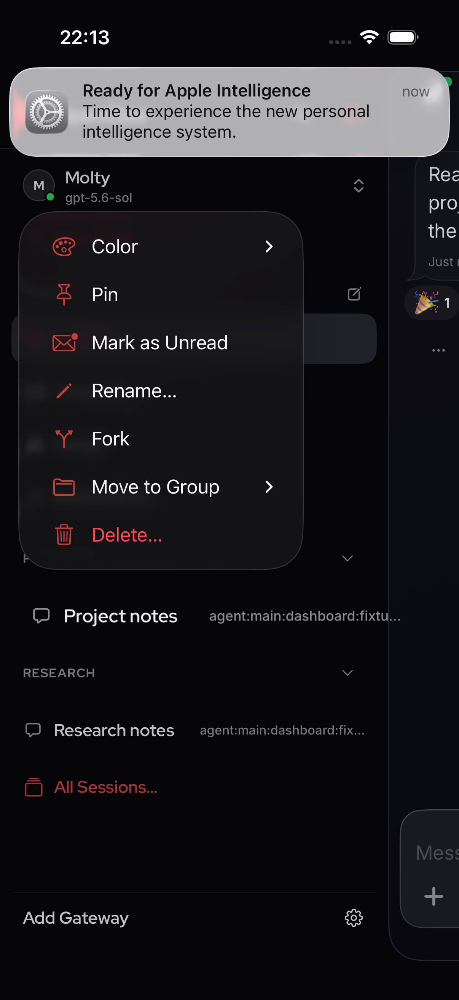

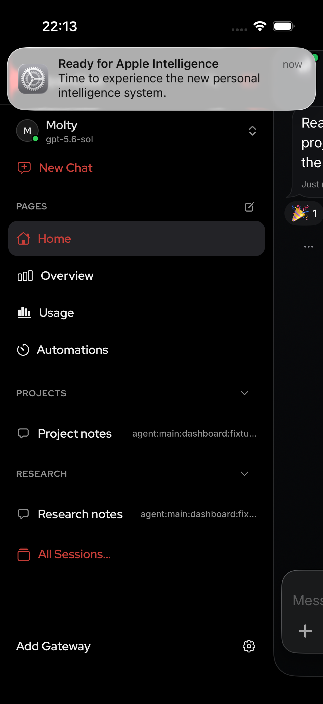

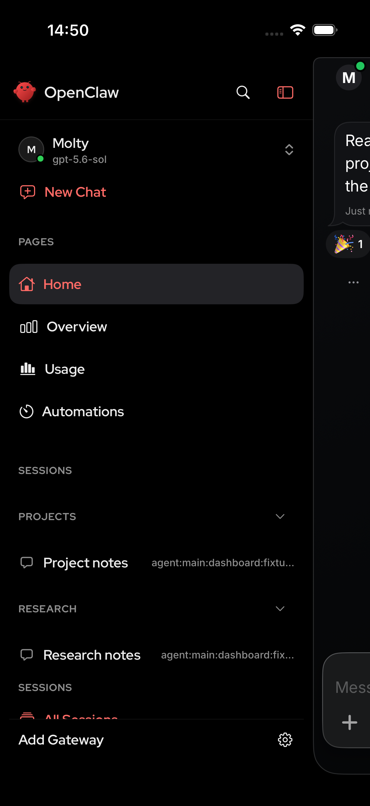

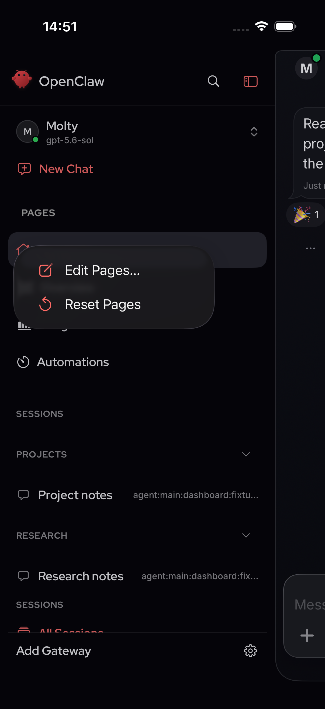

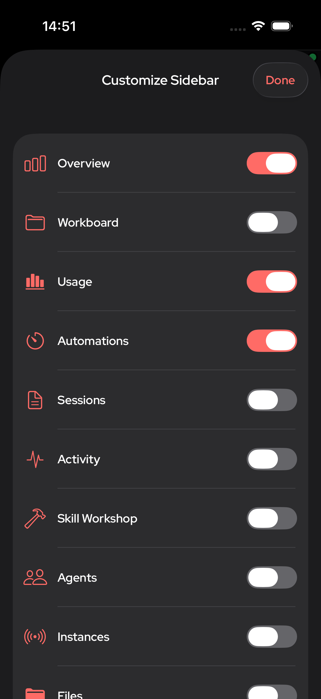

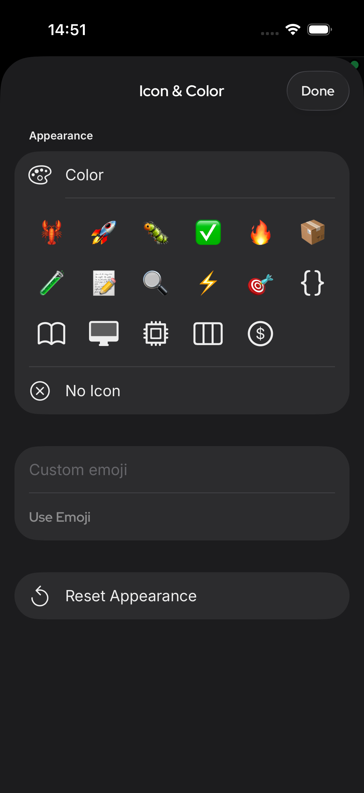

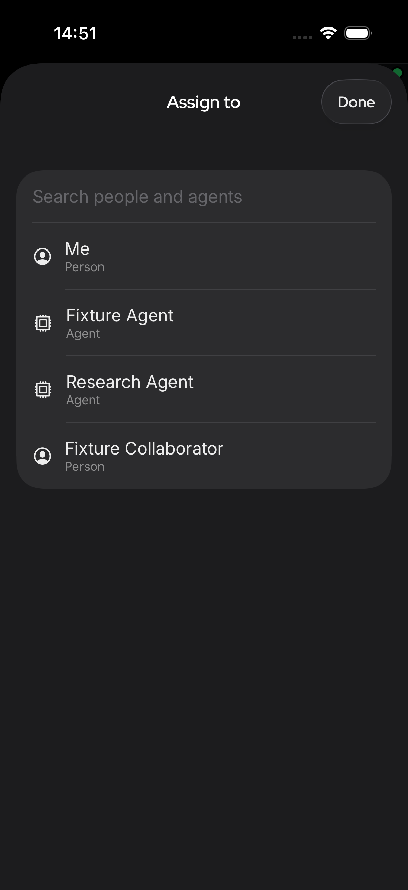

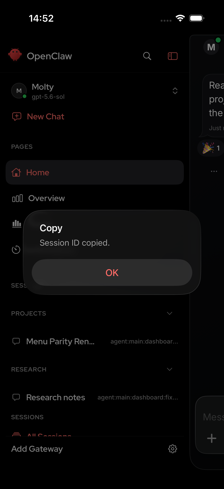

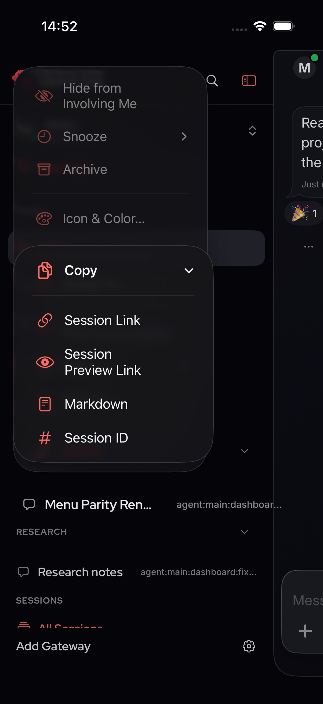

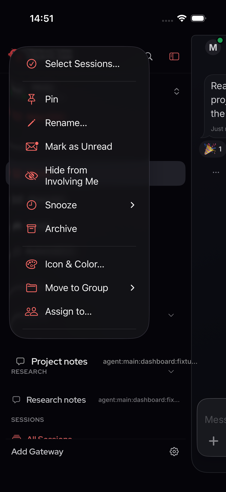

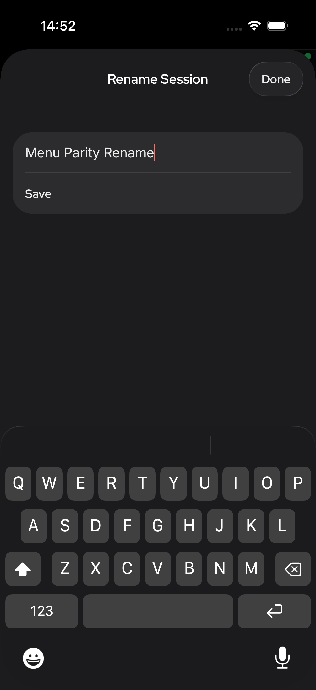

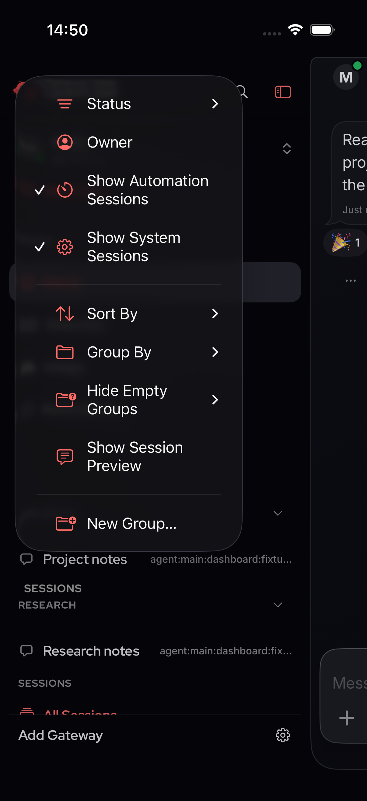

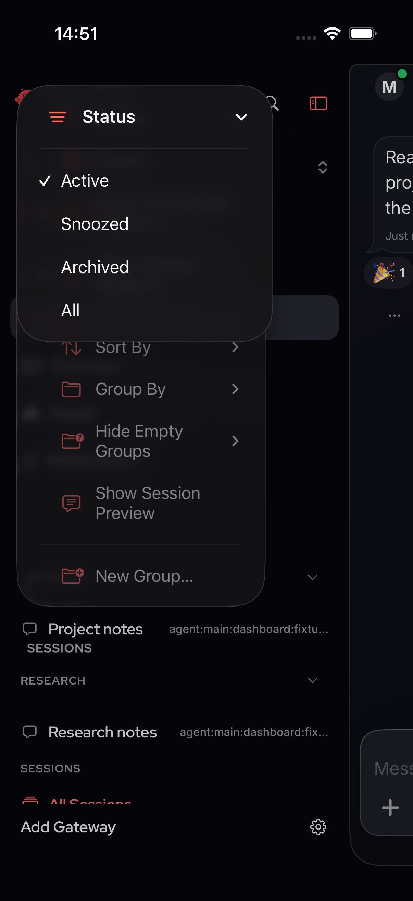
