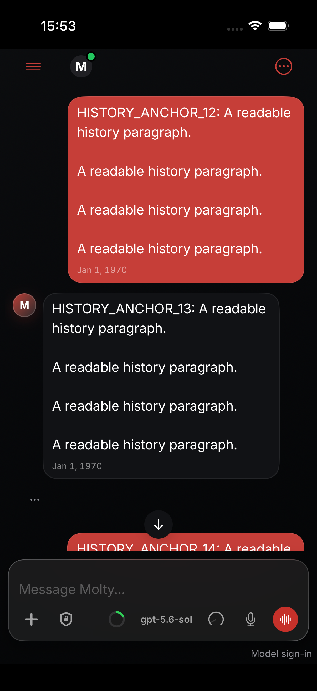
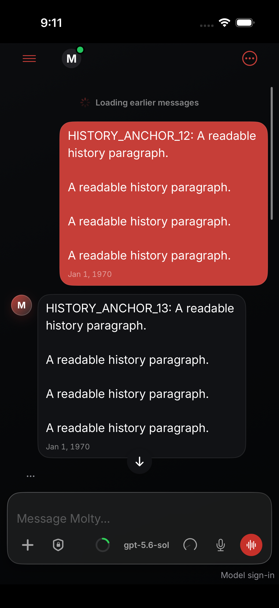
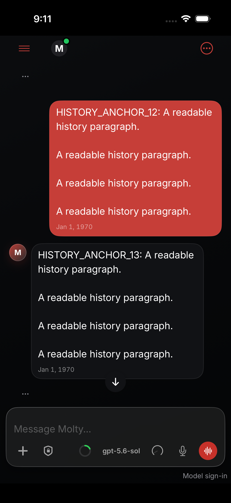
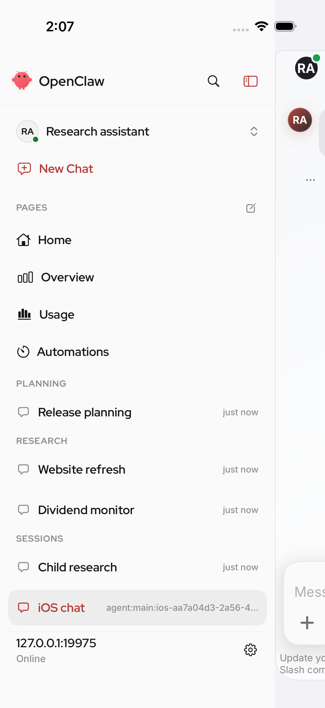
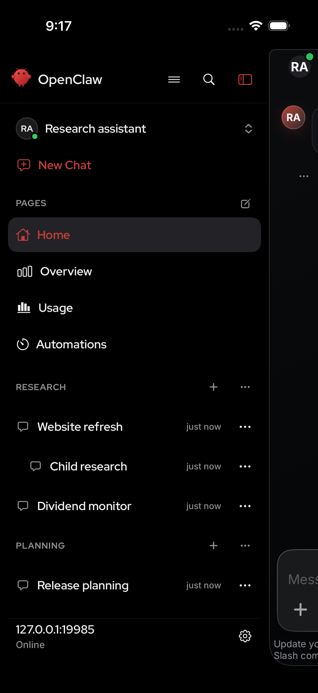

# iOS history and sidebar validation

Pinned upstream base: `8a754c57f5976e6bccab119ad47df0645c94f093`.
Reviewed/tested source patch SHA256: `17af6244ab46957a25885a15281a75c6fd51ed0968abee30154c46d828c17ce3` (56 files). A generated localization inventory update follows; it does not change product source. Synthetic simulator conversations only. No operator data, physical-device performance result, or production deployment is represented here.

## Completed checks

- [Shared owner output](owners-summary.txt): 565 tests in15 suites passed; 1.417 seconds test execution, 41.884 seconds including incremental compilation.
- [Native gates](native-results.json): scoped SwiftFormat and strict iOS/macOS lint passed; native macOS product compiled in34.352 seconds. Mac runtime not exercised.
- iOS app compiled; [sidebar/typography output](ios-unit-summary.txt):24 tests in2 suites passed (3.162 seconds execution).
- [Serialized UI result](ui-test-summary.json):8 passed,2 failed,590.851 seconds wall. Passing checks: navigation, voice reentry, short prepend, long prepend/true latest, streaming caption fragments, manual reader during tool updates, chat screenshot, sidebar nesting/management.
- [Localization verification](i18n-verify.txt):4379 inventory entries, zero drift. Generated additions/removals follow the candidate UI labels and synthetic fixture content.
- Independent adversarial source review found no blocker in paging fences, transcript identity/order, memo invalidation, native viewport ownership, or sidebar integration. It did not execute tests; its reviewed source excludes only the later generated inventory update.

## Unresolved checks — not a clean UI run

`testHistoryFirstPageAppearsBeforeOptionalMetadataCompletes` and `testEarlierHistoryButtonWorksBeforeMetadataCompletes` failed again in an unchanged, focused2-test diagnostic. Assertions, timeouts and fixture data remain unchanged.

The latest-reply capture visibly contains the final reply, but XCTest reports invalid infinite/zero bounds from Window through its descendants. Focused snapshots also return an empty application subtree. The earlier-history button accepted the tap and seven prior-final elements appeared in the query; visible usability is not established. That test's immediate-visible-older-reply expectation may conflict with intentional current-viewport preservation. A later recording frame shows SpringBoard, with no matching crash report recovered in the bounded investigation. The underlying cause remains unresolved; neither a product crash nor a simulator-only problem is established. Delayed-metadata display and cached reentry are not claimed fully validated.

## Inspected screenshots

The historical history defect used synthetic18-row/6-row pages on pre-fix source`c3efe215`: row12 moved from184.667 to132.0 points after prepending (52.667-point displacement). This is a historical reproduction, not the current upstream baseline. The candidate uses the same synthetic small-page fixture and passes the preserved-row assertion.

| Historical defect before paging | Historical defect after paging |
| --- | --- |
|  |  |

| Candidate before paging | Candidate after paging |
| --- | --- |
|  |  |

Historical sidebar source`222745e1504e4688156e02aa076edd40be95da69` uses light mode; candidate uses dark mode. The comparison concerns child nesting and management controls, not color changes. Loopback addresses and model labels are public synthetic fixture values.

| Historical sidebar | Candidate sidebar |
| --- | --- |
|  |  |

AI-assisted session record: isolated candidate extracted from implemented repairs, rebased to the pinned main base; a missing sidebar-order forwarding parameter was repaired and unit-tested; source hash parity checked against native test checkout; adversarial review and finalized screenshot inspection completed. Initial overlapping simulator drivers were stopped, and the reported10-case run had one serialized owner. The two unresolved failures were investigated without weakening assertions. No production or phone changes were made.
